# **YOLO**:

Yolo es la aplicación del Banco el país. Yolo se basa en la filosofía de  "You only live one" (Solo se vive una vez). Por ello ofrecemos a nuestros clientes la transformación del banco tradicional al banco digital. De esta forma pueden realizar operaciones de manera más rápida y sencilla. Todo a través del celular. 

## **Equipo de trabajo**

+ Loayza, Lourdes
+ Cisneros Torre, Yelitza.

## **Research**

### **Target: Millennials**

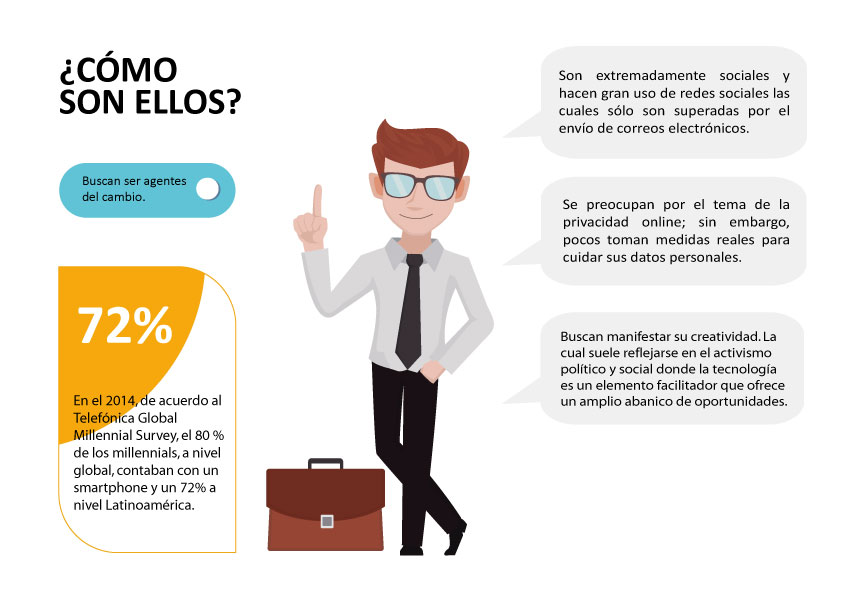

### **Stakeholders:**

#### **Cliente interno:**

- CEO
- Gerente de transformación digital
- Regulador estatal
- Inversionistas
- Gerente de marketing
- Gerentes de agencias.
- Community manager
- Jefe de ventas.

#### **Cliente externo:**

Clientes que entren en el perfil de millennials.

### **Reunión kick off:**

### **Guía de Entrevista personal banco**

##### **Objetivos:**

- ¿Cuál es el mensaje que se desea transmitir a los clientes a través de la banca digital?
- Descubrir cuáles son las expectativas del personal con respecto a la banca digital.

**CEO - Gerente de transformación digital - Inversionistas** 

- ¿Qué valores del banco queremos resaltar?
- ¿Qué operación interna podría digitalizarse para mejorar su trabajo?
- ¿Cuál es su aceptación al proceso de  cambio?
- ¿Cuál es su opinión sobre el cambio a una banca digital?

**Gerente de marketing - Gerentes de agencias - Jefe de ventas**

- ¿En los medios digitales cuáles son las operaciones con mayor tendencia?
- ¿Porcentaje de clientes obtenidos en el último año?
- ¿Cuál es el porcentaje de clientes perdidos?
- ¿Cuáles son los productos que tienen más ventas?
- ¿Cuáles son los productos que ya están digitalizados y si estos coinciden con los que tienen alta demanda?

**Gerente de Marketing - Community manager**

- ¿Cuáles son los reclamos más frecuentes?

**Regulador estatal**

- ¿Cuáles son las limitaciones que tenemos?

### **Guía de Entrevista Millenial**

#### **Objetivos:**

- ¿Cuál es la percepción de los clientes con respecto a los servicios que actualmente brinda el banco y como es la interacción digital de estos servicios?
- Descubrir cuáles son las expectativas de los usuarios con respecto a la banca digital.

#### Screener validation

- Por favor dime tu nombre.
- ¿Cuántos años tienes?
- ¿En qué distrito vives?
- ¿Cómo estuvo tu día?

#### 1.- Internet y redes sociales

- ¿Con qué frecuencia te conectas a Internet y qué dispositivos utilizas? ¿Qué actividades realizas con frecuencia en internet?
- ¿Usas redes sociales? ¿Por qué las usas? ¿Qué es lo que más te gusta?
- ¿Utilizas tu cuenta de redes sociales para loguearte o registrarte en otras páginas web? ¿Qué te motivó a hacerlo?

#### 2.- Compra online

- ¿Has realizado compras online alguna vez? ¿Qué artículo compraste?
- ¿Cómo pagaste por ese producto?
- ¿Puedes contarme un poco más sobre esa experiencia?
- ¿Tuviste algún problema con el proceso de compra?

#### 3.- Bancos

- ¿Recuerdas tu primera experiencia con un banco? 
- ¿Que opinas de los bancos locales? 
- ¿Cuentas con algún producto bancario? ¿Cual o cuales son?
- ¿Con qué frecuencia realizas operaciones bancarias? ¿Cuál fue la última que realizaste? ¿Donde realizaste esa operación?
- ¿Puedes contarme cómo fue esa experiencia? ¿Que te hubiera gustado mejorar?

#### 4.- Percepción respecto al banco de tu preferencia

- ¿Por qué te decidiste por ese banco? ¿Con qué valores te identificas?
- ¿Siempre has sido cliente de ese banco? Si no fue así, ¿Qué te hizo cambiar?
- ¿Sientes que tienes control sobre tu dinero y que este está seguro en el banco?

#### 5.- Banca por Internet

- ¿Haz realizado transacciones bancarias a través de Internet?
- Si lo hiciste ¿Por qué razón fue?
- ¿Cómo fue esa experiencia? ¿Lograste el objetivo que tenías? ¿Qué dificultades pudiste encontrar? ¿De poder mejorar algo que cambiarías?

### **Business Model Canvas**

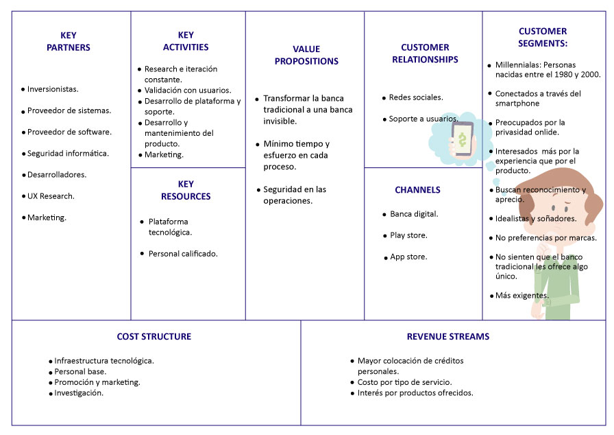

### **Plan propuesto de investigación:**

#### Meta de la investigación:

Identificar las variables que determinan la preferencia de los millennials en temas financieros y analizar su comportamiento en el contexto digital.

#### Objetivo de la investigación:

Conocer las características y motivaciones de los millennials, en  relación con los procesos financieros que realizan y su comportamiento en los medios digitales.

#### Producto a investigar:

La banca tradicional y digital

#### Técnicas a utilizar:

- Entrevistas a profundidad
- Encuestas
- Focus group.
- Testing

[Visualizar el planner en excel](https://goo.gl/pkC3op)

## **RECOPILACIÓN Y ANÁLISIS DE DATOS**

### **Resultados de Entrevistas**

#### 1.- **Entrevista a Ari** 

- Edad: 27 años.
- Profesión: Diseñadora Gráfica

[Entrevista - Ari](https://drive.google.com/file/d/12dFhUSueyry5ou4dzk2CqRFxKFZWS4ZD/view?usp=sharing)

#### 2.- **Entrevista a Abigail**

- Edad: 33 años.
- Profesión: Operadora de Logística

[Entrevista Abigail](https://drive.google.com/file/d/1Rm5dbgPojK0U7Ps7bTkixeLAkgR8s60Z/view?usp=sharing)

#### 3.- **Entrevista a Michael**

- Edad: 32 años.
- Profesión: Senior Sales Engineer

[Entrevista Michael](https://drive.google.com/file/d/1H4py9OuUL5aTsNmttm7Rrgd2_6L-QvKX/view?usp=sharing)

#### 4.- **Entrevista a Pablo**

- Edad: 33 años.
- Profesión: Médico psiquiatra

[Entrevista Pablo](https://drive.google.com/file/d/1c8DqEdmcjyzF5oqti7MEG2Q-Bw0oHNr7/view?usp=sharing)

#### 5.- **Entrevista a Sandra**

- Edad: 32 años.
- Profesión: Médico ocupacional

[Entrevista Sandra](https://drive.google.com/file/d/1n55xB34wB0JWZwl8sDVOCeYYDkVuRftX/view?usp=sharing)

### **Resultados de Encuesta Online**

#### Conclusiones de la encuesta online.

- El de los encuestados  se conecta al Internet entre 5 y 7 horas al día, especialmente para navegar y actualizar sus redes sociales.
- El 81% de los encuestados utiliza su celular para conectarse a Internet.
- El 85% de los encuestados confían en el banco que tienen ahora y utilizan la banca por Internet. Entre los motivos impotantes para ellos al momento de elegir un banco se encuentran la buena atención al cliente, las promociones y las bajas comisiones y cobros por mantenimiento.
- Si tuvieran una banca totalmente digital, lo más importante para ellos sería la seguridad de sus datos y su dinero, y los procedimientos simples.

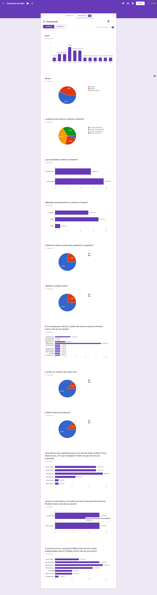

##  **SÍNTESIS Y DEFINICIÓN** 

### **Identificación de Insights:**

Por medio de las entrevistas y las encuestas online, identificamos los siguientes insights:

- Los Millennials les preocupa la seguridad de sus datos.
- Los millennials necesitan procesos de operaciones rápidas y sencillas.
- Los millennials no saben bien como organizar sus finanzas.

### **Benchmark:**

Por medio del research ubicamos las siguientes funcionalidades en base a los principales competidores:

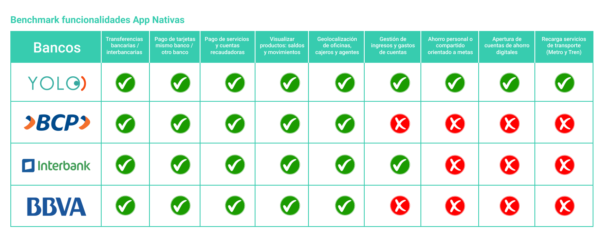

[Visualizar detalle de funcionalidades encontradas](https://drive.google.com/file/d/1JUxskVloNYXimElifF148jT3CWyuxBYc/view?usp=sharing)

### **User persona**

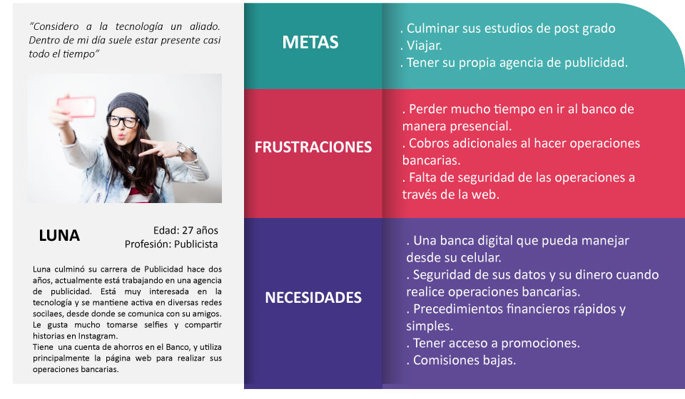

### **Definición de los Problems Statements**

- **Luna necesita** manejar sus operaciones bancarias por el celular,**porque** es más práctico.
- **Luna necesita** poder pagar los recibos de los servicios de manera rápida **para** evitar las colas.
- **Luna necesita** tener el reporte de sus finanzas **para** que pueda organizarse y ahorrar.
- **Luna necesita** ayuda para poder lograr las metas que se pone **porque** se le hace difícil ahorrar.

### **Definición de los Feature List**

#### **1. Registro**
- Registro de cliente nuevo a través de un formulario enviado al correo del usuario

#### **2. Inicio de sesión.**

- Inicio de sesión con DNI y contraseña de banca digital
- Ventana de saludo.

#### **3. Perfil**

- Poder ver sus cuentas y el saldo disponible.

#### **4. Pago de servicios (Luz)**

- Pago de servicio a través del número de suministro.
- Elección desde que cuenta quiere pagar.
- Envío del recibo al correo electrónico.

#### **5. Recarga (Metropolitano)**

- Recarga de tarjeta del Metropolitano a través del código de la tarjeta.
- Elección desde que cuenta quiere pagar.

#### **6. Finanzas** 

- Selección de periodos de tiempo del que se quiere ver el reporte.
- Gráfica de estadística.
- Reporte de los gastos por secciones y con detalles de porcentajes.
- Cada sección se puede ver de manera detallada. Explicando los datos de donde se registraron los gastos y los montos. 

#### **7. Transferencias.**

- La elección del destinatario de la transferencia se puede hacer por número de cuenta o de celular.
- Se puede elegir desde que cuenta realizar la transferencia.
- Se genera un comprobante electrónico de la transferencia.

#### **8. Metas (Individuales y compartidas)**

- Poder elegir entre una meta individual y compartida.
- La meta compartida solo se concreta cuando la persona involucrada lo acepta.
- Poder elegir el periodo en que se descontarán las cuotas.
- Generación de cuotas de acuerdo a la meta económica planteada. 

#### **9. Reserva de turno de atención.**

- Poder reservar un turno de atención en oficina.
- De acuerdo a la oficina ingresada se muestran los días y horarios disponibles.
- Generación de ticket electrónico, que se envía al e-mail del usuario.

#### **10. Encuéntranos.**

- Mediante un buscador el usurio puede encontrar las oficinas, cajeros o agentes más cercanos.
- Una vez elegido el destino, puede elegir como llegará al destino : "A pie" o "En auto". En ambos casos se envían indicaciones al usuario de como llegar.
 
#### **11. La alcancía.**

 - Ganar promociones a través de la alcancia.

### **User Flow**

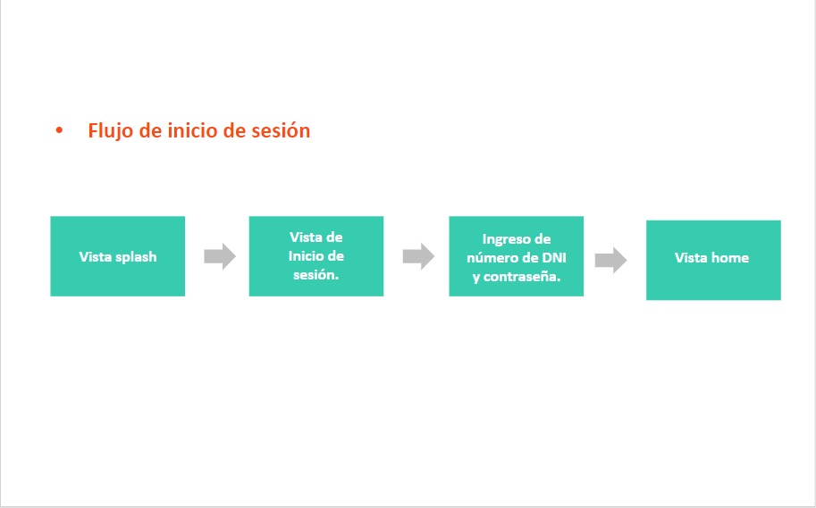
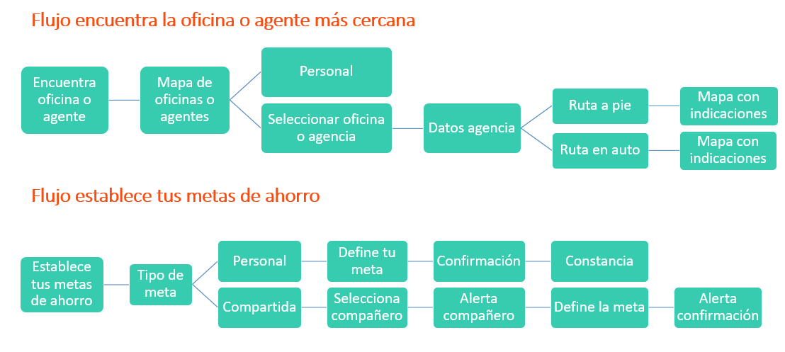
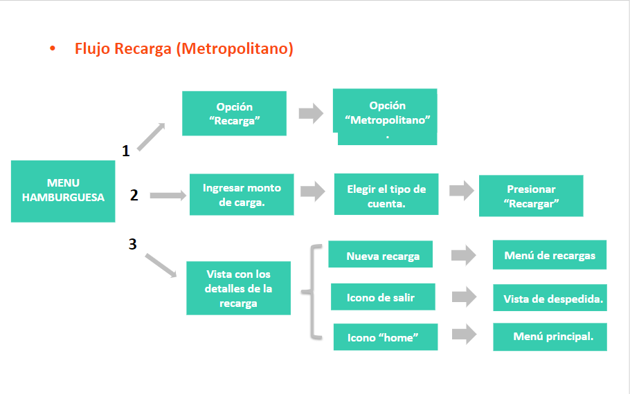
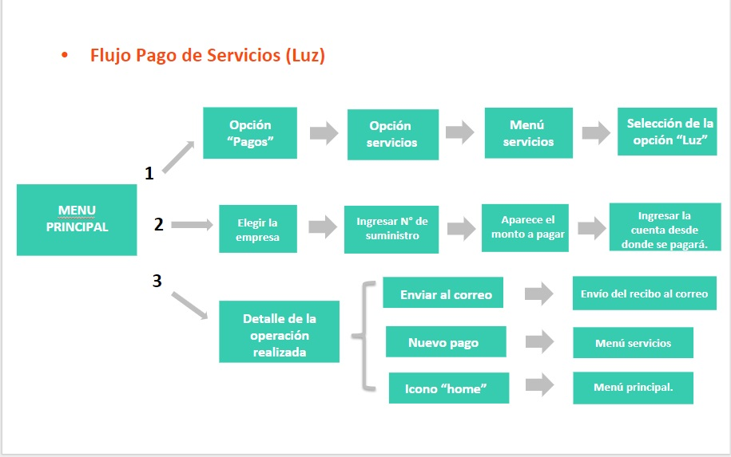
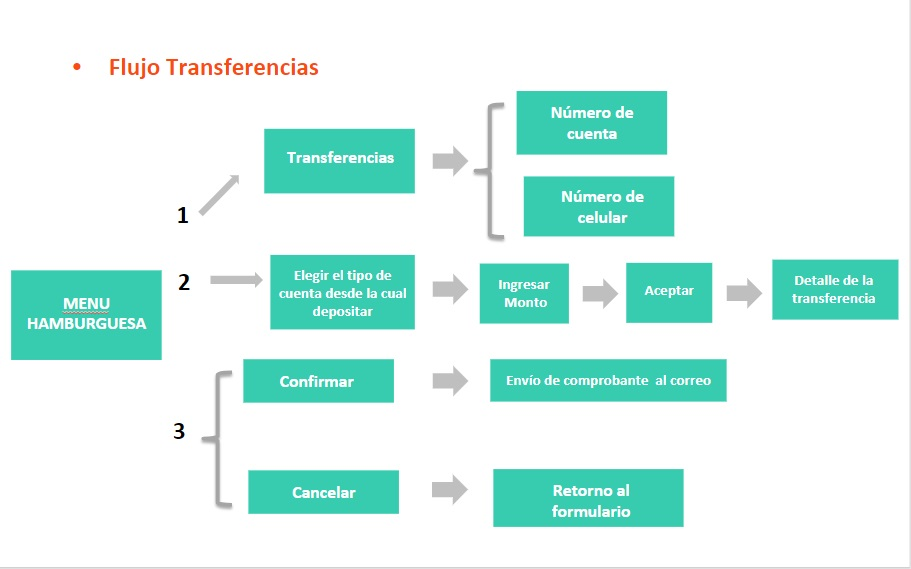
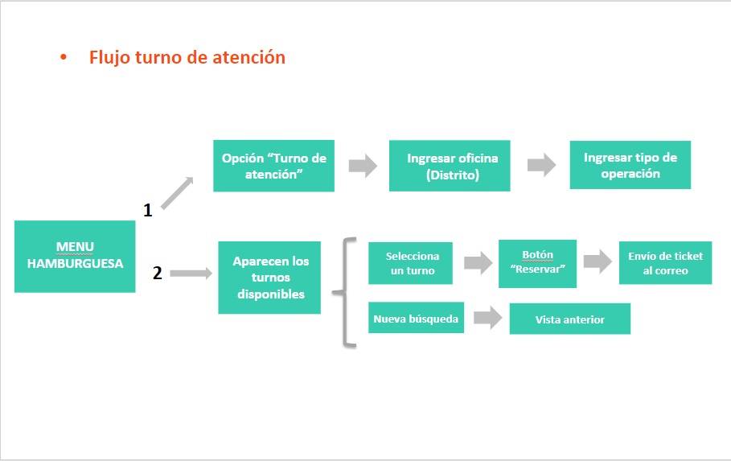
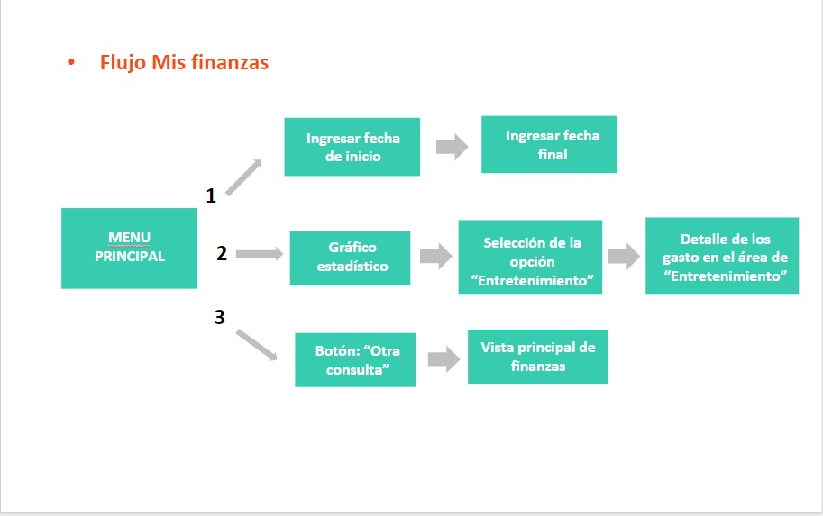

## **PAPER PROTOTYPING:**

[Enlace al paper prototyping](https://docs.google.com/presentation/d/1TtrHyUErSiFr4_jnAvplWIq5AjBWEVFixu1g79m_bvE/edit?usp=sharing)

### **Testing del paper prototyping.**

Se realizó el testing con 4 personas. Se obtuvo el siguiente feedback

- No entendían el término "Reservar que se utlizó", lo confundían con la reserva en algún restaurante.
- No consideraban necesario el código QR, que se generaba luego de pagar un servicio.
- Confusión sobre cuál era el menú principal. 
- Cambiar el diseño de la pantalla de presentación de las metas, tratar de unificar los pasos junto con los textos.
- Cambiar los textos de los datos de las metas, añadir un calendario de fecha de inicio ya que quizas me gustaria empezar la meta meses posteriores.
- Quitar numero de transacción ya que no lo consideraban necesario.
- Sugieron cambios en textos a la hora de hacer las alertas, no usar la palabla de comprobante y cambiarla por constancia.

## **PROTOTIPO DE ALTA FIDELIDAD.**

### **Flujos realizados:**

1. Inicio de sesión
2. Pago de servicios (Luz)
3. Recargas (Metropolitano)
4. Consulta de mis finanzas
5. Encuéntranos (Ubicación de oficinas, agencias y cajeros)
6. Metas (individuales y compartidas)
7. Reservar turno de atención. 

### **Testing del prototipo de alta fidelidad**

[Enlace al prototipo de alta fidelidad](https://marvelapp.com/c4af799/screen/39428456)

Se realizó el testing con 4 personas. Se obtuvo el siguiente feedback

- Dentro de los procesos testeados el flujo de las metas y finanzas tuvieron aceptación y les parecio una idea atractiva. 
- En el cuadro de finanzas las barras tenian un desorden en la numeración, sugirieron hacer el cambio.
- En el flujo de la meta compartida solicitaron una previsualización de los montos totales y las cuotas individuales antes de mandar la alerta y la opción de hacer simulaciones de cuotas antes de completar la operación.

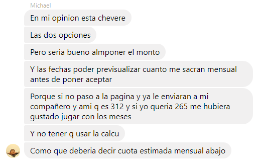
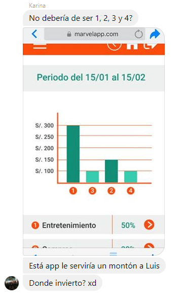
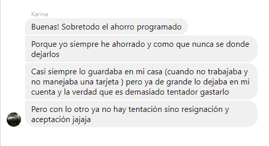

### **Flujos Añadidos:**

1. Registro para clientes nuevos.
2. Promociones a través de "La alcancía".
3. Vista del perfil.
4. Mis cuentas. (Registro de las cuentas del usuario)

## **HERRAMIENTAS UTILIZADAS:**

- Marvel
- Figma.
- Prototipado en papel.
- Adobe Ilustrator