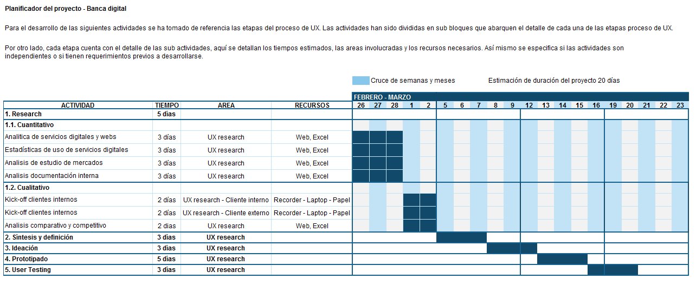

# Banco 100% digital:

El Banco del País, es una institución de muchos años y actualmente está pasando por un proceso de transformación digital. Como parte de este proceso, han implementado un área de innovación que quiere llegar de una mejor manera a los usuarios más jóvenes. Por lo que se han propuesto crear un banco 100% digital dirigido para millenials.

## Target:

## Stakeholders:

#### Cliente interno:

- CEO
- Gerente de transformación digital
- Regulador estatal
- Inversionistas
- Gerente de marketing
- Gerentes de agencias.
- Community manager
- Jefe de ventas.
- 

#### Cliente externo:

Clientes que entren en el perfil de millennials.

## Reunión kick off:

### PREGUNTAS (Cliente interno)

**CEO - Gerente de transformación digital - Inversionistas** 

- ¿Qué valores del banco queremos resaltar?
- ¿Qué operación interna podría digitalizarse para mejorar su trabajo?
- ¿Cuál es su aceptación al proceso de  cambio?
- ¿Cuál es su opinión sobre el cambio a una banca digital?

**Gerente de marketing - Gerentes de agencias - Jefe de ventas**

- ¿En los medios digitales cuáles son las operaciones con mayor tendencia?
- ¿Porcentaje de clientes obtenidos en el último año?
- ¿Cuál es el porcentaje de clientes perdidos?
- ¿Cuáles son los productos que tienen más ventas?
- ¿Cuáles son los productos que ya están digitalizados y si estos coinciden con los que tienen alta demanda?

**Gerente de Marketing - Community manager**
- ¿Cuáles son los reclamos más frecuentes?

**Regulador estatal**

- ¿Cuáles son las limitaciones que tenemos?

### PREGUNTAS (Cliente externo)

- ¿Qué productos y/o servicios tiene del banco?
- ¿Qué opinión tiene acerca de los productos y/o servicios del banco?
- ¿Qué operaciones bancarias son las que más realiza?
- ¿Qué operaciones bancarias son más tediosas?
- ¿Por qué canal de atención se relaciona más con el banco?
- ¿Cuál es el canal de atención con el que ha tenido más problemas?
- ¿Cuáles son los valores que espera del Banco El País?
- ¿Cuál es el cambio trascendental que espera de un banco?

## Planificación de actividades:

- Visualizar el planner en excel https://goo.gl/pkC3op

 
